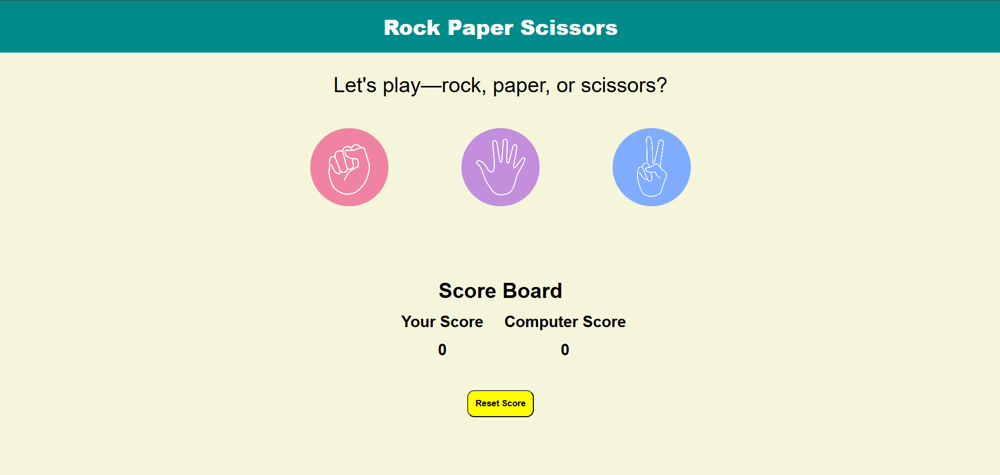

# RockPaperScissors

This is a simple Rock Paper Scissors game implemented using HTML, CSS, and JavaScript.

## How to Play

1. Open the `index.html` file in a web browser or use a live server to view the game.
2. Click on one of the choices (rock, paper, or scissors) to play against the computer.
3. The computer will randomly pick a move.
4. The result of the game will be displayed, and the scores will be updated accordingly.
5. Click the "Reset Score" button to reset the scores.

## Features

- Interactive UI with images for rock, paper, and scissors.
- Real-time score updates.
- Reset button to clear scores and start fresh.

## Technologies Used

- HTML for the structure of the game.
- CSS for styling the game.
- JavaScript for game logic and interactivity.

## Screenshot

